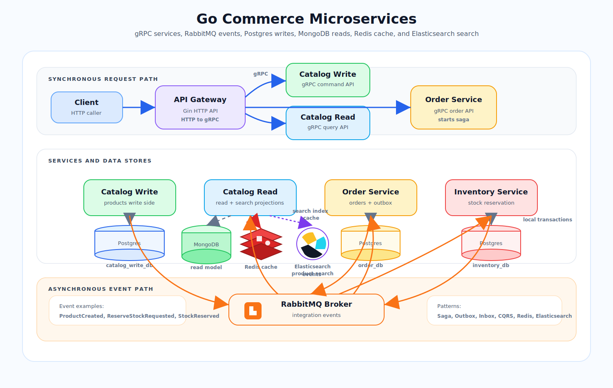
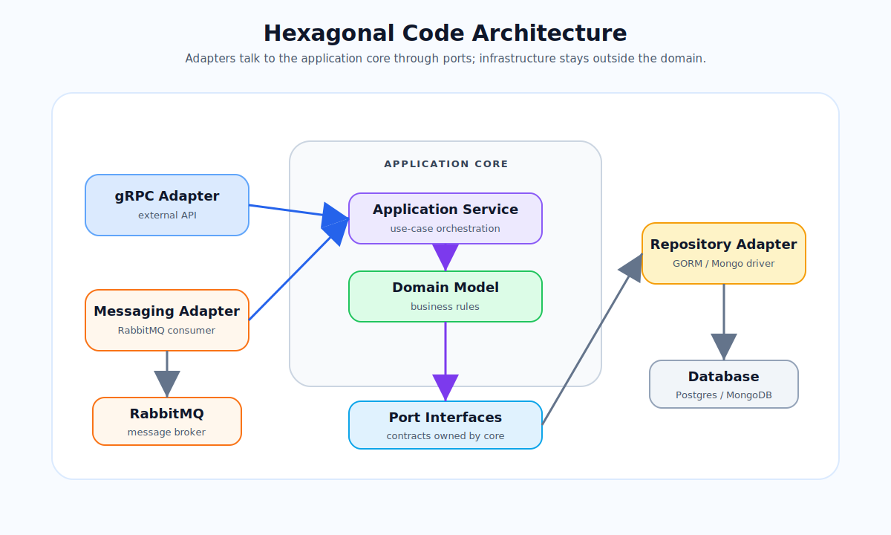
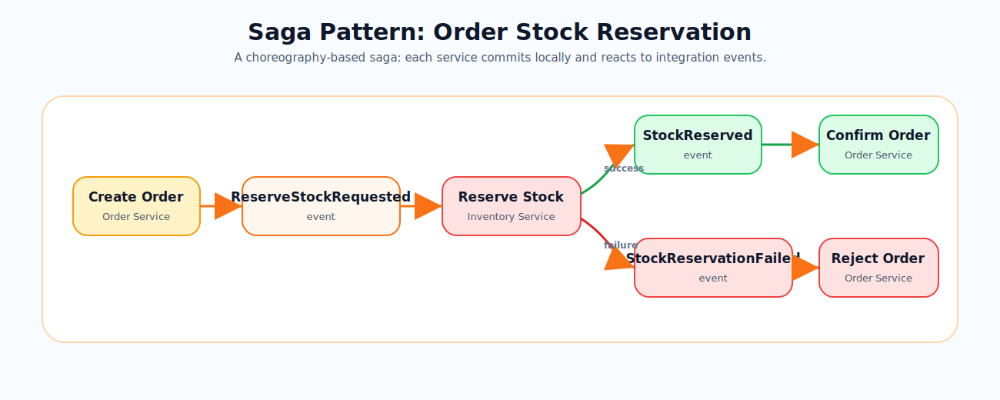
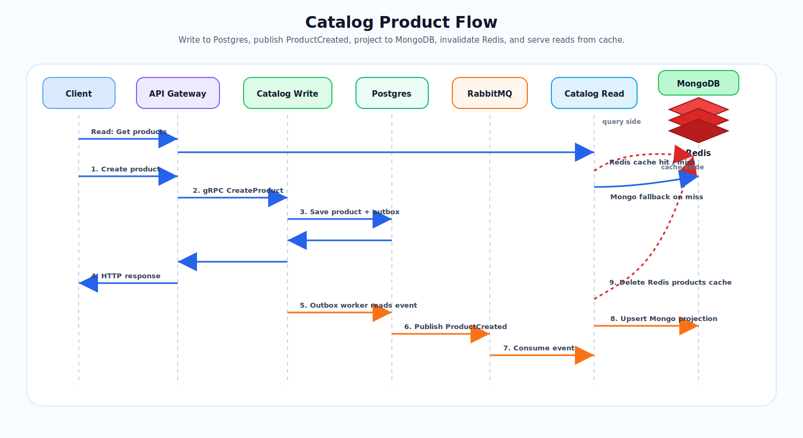
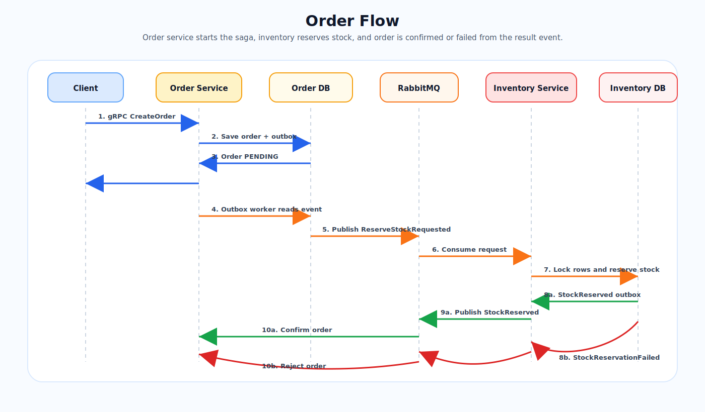

# Go Commerce Microservices

`Go Commerce Microservices` is a learning-focused ecommerce backend built with Go and a small set of practical microservices patterns: gRPC service communication, REST API gateway, event-driven messaging with RabbitMQ, Saga workflow, Postgres write models, MongoDB read models, Redis caching, Outbox/Inbox patterns, dependency injection with Uber Fx, structured logging with Zap, and configuration with Viper.

## Features

- Using `Go` with a multi-module workspace.
- Using `Microservices Architecture` with separate services for catalog, orders, inventory, and API gateway.
- Using `Hexagonal Architecture` style inside services with application core, ports, and adapters.
- Using `gRPC` for internal service APIs.
- Using a REST `API Gateway` built with `Gin`.
- Using `Event Driven Architecture` with `RabbitMQ`.
- Using the `Outbox Pattern` for reliable message publishing from write-side services.
- Using the `Inbox Pattern` for idempotent message consumption.
- Using the `Saga Pattern` for the order and stock reservation workflow.
- Using `CQRS` between catalog write and catalog read services.
- Using `Mediator Pattern` in catalog read service with `go-mediatr`.
- Using `Postgres` for write-side services and transactional data.
- Using `MongoDB` for catalog read projections.
- Using `Redis` as a cache for catalog read queries.
- Using `GORM` for Postgres persistence.
- Using `Uber Fx` for dependency injection and application lifecycle.
- Using `Zap` for structured logging.
- Using `Viper` and `godotenv` for configuration and local environment loading.
- Using `go-ozzo/ozzo-validation` for application input validation.
- Using `go-playground/validator` for transport/request validation where needed.
- Using `Docker` and `Docker Compose` for local infrastructure and service deployment.
- Using `Testcontainers`, unit tests, integration tests, and E2E tests for selected flows.
- Using `GitHub Actions` CI for formatting, vet, tests, and build.

## Services

### API Gateway

Path:

```text
api-gateway/
```

The API Gateway exposes HTTP endpoints and calls backend services through gRPC.

Main responsibilities:

- Receive external HTTP requests.
- Validate and map request DTOs.
- Call catalog/order gRPC services.
- Return HTTP responses to clients.

### Catalog Write Service

Path:

```text
services/catalog-write-service/
```

The write side of catalog. It stores product data in Postgres and publishes product events through the outbox.

Main responsibilities:

- Create/update catalog products.
- Store product write data in Postgres.
- Save product integration events in the outbox.
- Publish outbox messages to RabbitMQ.

### Catalog Read Service

Path:

```text
services/catalog-read-service/
```

The read side of catalog. It consumes product events and stores read projections in MongoDB.

Main responsibilities:

- Consume catalog events from RabbitMQ.
- Project product data into MongoDB.
- Cache catalog read results in Redis.
- Invalidate Redis cache when product events update the read model.
- Serve product read queries over gRPC.
- Use CQRS/Mediator handlers for catalog read features.

### Order Service

Path:

```text
services/order-service/
```

Handles order creation and order status changes.

Main responsibilities:

- Create orders in Postgres.
- Save `ReserveStockRequested` events in the outbox.
- Publish order outbox messages to RabbitMQ.
- Consume stock result events.
- Confirm or reject orders based on inventory results.

### Inventory Service

Path:

```text
services/inventory-service/
```

Handles stock reservation.

Main responsibilities:

- Consume `ReserveStockRequested` events.
- Lock inventory rows during reservation using Postgres transactions.
- Reserve stock when quantity is available.
- Publish `StockReserved` or `StockReservationFailed` events through the outbox.

### Notification Service

Path:

```text
services/notification-service/
```

This service exists in the repository structure, but it is not part of the main running workflow yet.

## System Architecture



The project uses synchronous communication for request/response APIs and asynchronous messaging for cross-service workflows.

- Synchronous path: API Gateway calls backend services through gRPC.
- Asynchronous path: services publish integration events through RabbitMQ.
- Write services use Postgres for transactional data.
- Catalog read service uses MongoDB as a read projection.
- Redis caches catalog read results and is invalidated when product events are consumed.

## Code Architecture

Most services use a hexagonal architecture style. The application core owns the domain rules and ports, while adapters handle gRPC, RabbitMQ, and database details.



Catalog read service also practices a feature-based CQRS/Mediator shape. That flow is:

```text
adapter -> query/command -> mediator -> handler -> repository port -> repository adapter -> database
```

## Saga Pattern

The order workflow uses an event-driven Saga. There is no single distributed database transaction across order and inventory services. Instead, each service commits its own local transaction and publishes the next event.



Current saga steps:

- Order service creates an order with `PENDING` status.
- Order service publishes `ReserveStockRequested` through its outbox.
- Inventory service consumes the event and tries to reserve stock.
- Inventory service publishes either `StockReserved` or `StockReservationFailed`.
- Order service consumes the result event.
- Order service changes the order to `CONFIRMED` or `FAILED`.

This is a choreography-based Saga because services react to events directly. There is no separate Saga orchestrator service yet.

## Main Flows

### Catalog Product Flow



### Order Flow



## Shared Packages

Path:

```text
pkg/
```

Current shared packages:

- `configloader`: shared Viper configuration loading, environment binding, and `.env` loading.
- `logger`: shared Zap logger setup.
- `errs`: shared error helpers.

## Configuration

Each service has a `config/` folder with JSON configuration files for different environments.

The project uses:

- JSON config files for non-secret defaults.
- Environment variables for deployment-specific values and secrets.
- `.env` files for local development convenience.
- Viper to merge config files and environment variables.

Environment variables should override config file values.

## Infrastructure

Infrastructure is separated from application services.

Infrastructure Compose file:

```text
deployments/docker-compose.infrastructure.yml
```

Includes:

- Postgres
- RabbitMQ
- MongoDB
- Redis

Services Compose file:

```text
deployments/docker-compose.services.yml
```

Includes:

- API Gateway
- Catalog Write Service
- Catalog Read Service
- Order Service
- Inventory Service

## Development Commands

Install local tools:

```bash
make install-tools
```

Start local infrastructure:

```bash
make dev-up
```

Stop local infrastructure:

```bash
make dev-down
```

Run migrations:

```bash
make migrate-up
```

Generate protobuf code:

```bash
make proto
```

Run a service with Air:

```bash
make run-order
make run-inventory
make run-catalog-write
make run-catalog-read
make run-api-gateway
```

Run checks:

```bash
make fmt
make test
make vet
```

Run E2E tests:

```bash
make test-e2e
```

Build Docker images:

```bash
make run-docker-build
```

Start services with Docker Compose:

```bash
make deploy-up
```

Stop services:

```bash
make deploy-down
```

## Testing

The project uses several testing levels:

- Unit tests for small handlers/services with fake or mocked dependencies.
- Repository integration tests with real database dependencies where useful.
- E2E tests for business flows across services.

Current E2E tests live in:

```text
services/test/e2e/
```

E2E tests are intended to run against the Docker Compose environment. They may write test data to Postgres and MongoDB, so use unique test data and clean volumes when needed.

## CI

The GitHub Actions workflow lives in:

```text
.github/workflows/ci.yml
```

CI currently runs:

- `gofmt` check
- `go vet`
- `go test`
- `go build`

E2E tests and deployment are intentionally separate from the normal CI path.

## Project Status

This is a learning and practice project. Some production-ready pieces are intentionally still evolving, such as full health checks, retry policy, deployment automation, observability, and complete E2E coverage.
